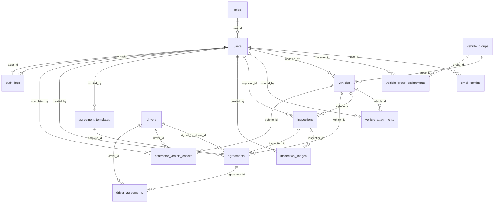

# Vehicle Track – Data Models (PostgreSQL/Drizzle)

Guiding principles: typed schemas, no `any`; prefer enums; soft-delete via status flags where possible; enforce FK constraints; add practical indexes.

## Core Auth & Roles

- `roles`: id (pk, uuid), name (enum: admin, manager, inspector, viewer), description.
- `users`: id (pk, uuid), username, email, phone, first_name, last_name, role_id (fk roles), password_hash (Better Auth managed), active (bool), created_at, updated_at.
  - Indexes: unique(email), unique(username), idx_users_role, idx_users_active.
- `email_configs`: id (pk, uuid), user_id (fk users), smtp_host, smtp_port, smtp_username, smtp_password_enc, from_email, from_name, active (bool), created_at, updated_at.

## Fleet

- `vehicles`: id (pk, uuid), year int, make, model, license_plate, vin, status (enum: available, assigned, maintenance, temporarily_assigned, leased_out, retired, sold), ownership (enum: owned, external, leased_out), owner_company nullable, fuel_type (enum: petrol, diesel, electric, hybrid, lpg), transmission (enum: manual, automatic, cvt, semi_automatic), engine_size_l numeric nullable, odometer numeric nullable, purchase_date date nullable, last_service_date date nullable, next_service_due date nullable, notes text nullable, group_id (fk vehicle_groups nullable), created_at, updated_at, updated_by (fk users nullable).
  - Indexes: idx_vehicles_status, idx_vehicles_group, idx_vehicles_license_plate (non-unique), idx_vehicles_vin (non-unique), idx_vehicles_updated_at.
- `vehicle_groups`: id (pk, uuid), name, description nullable, type nullable, contract_id nullable, area_manager_contact nullable, created_at, updated_at, created_by (fk users).
- `vehicle_group_assignments`: id (pk, uuid), group_id (fk vehicle_groups), manager_id (fk users), created_at.
  - Composite unique (group_id, manager_id).
- `vehicle_attachments`: id (pk, uuid), vehicle_id (fk vehicles), file_url, file_name, file_size_bytes int, content_type, created_at, created_by (fk users).

## Drivers

- `drivers`: id (pk, uuid), first_name, last_name, email nullable, phone nullable, notes text nullable, created_at, updated_at, created_by (fk users).

## Inspections

- `inspections`: id (pk, uuid), vehicle_id (fk vehicles), inspector_id (fk users nullable), status (enum: draft, submitted), exterior_condition text, interior_condition text, mechanical_condition text, additional_notes text nullable, submitted_at nullable, created_at, updated_at.
- `inspection_images`: id (pk, uuid), inspection_id (fk inspections), section (enum: exterior, interior, mechanical), file_url, file_name, file_size_bytes int, content_type, created_at, created_by (fk users).

## Agreements

- `agreement_templates`: id (pk, uuid), title, content_richtext, active bool, created_at, updated_at, created_by (fk users).
- `agreements`: id (pk, uuid), vehicle_id (fk vehicles), inspection_id (fk inspections), template_id (fk agreement_templates), status (enum: draft, pending_signature, signed, terminated), signed_by_driver_id (fk drivers nullable), signed_at nullable, created_at, updated_at, created_by (fk users).

## Drivers & Agreements linkage

- `driver_agreements`: id (pk, uuid), driver_id (fk drivers), agreement_id (fk agreements), role (enum: signer, viewer), created_at.
  - Composite unique (driver_id, agreement_id, role).

## Compliance

- `contractor_vehicle_checks`: id (pk, uuid), driver_id (fk drivers), vehicle_id (fk vehicles), cycle_week_start date, status (enum: pending, complete), submitted_at nullable, completed_at nullable, completed_by (fk users nullable), created_at, updated_at.
  - Indexes: idx_cvc_cycle_week, idx_cvc_status, idx_cvc_driver, idx_cvc_vehicle.

## Audit & Activity

- `audit_logs`: id (pk, uuid), actor_id (fk users nullable), entity_type, entity_id, action, metadata jsonb, created_at.
  - Indexes: idx_audit_entity, idx_audit_actor.

## Notes on Validation

- License plate and VIN are non-unique per spec; consider soft validation only.
- Phone (AU) validated at API/UI; store as text.
- Attachment limits enforced at application layer; store size/content_type for checks.

## Migrations & Seeds

- Seed roles (admin, manager, inspector, viewer).
- Optionally seed an initial admin user and baseline agreement template.

## ERD (Mermaid)

