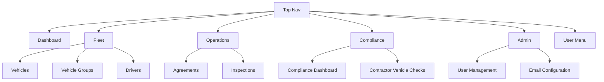

# Vehicle Track – Low-Level Design (Navigation & Page Map)

## Navigation Structure

## Pages, Features, Relationships

### Dashboard

- Recent Vehicles/Inspections/Agreements with “View All” links to respective list pages.
- Management Center cards linking to Vehicle Groups, User Management, All Vehicles.
- Read-only for Inspector/Viewer; Admin/Manager see same content.

### Fleet

- Vehicles: list (filters, pagination), create/edit (required/optional fields, single attachment), detail, status model, group association.
- Vehicle Groups: group list, create (name + desc TBD), detail (vehicles in group, assign managers), back to groups.
- Drivers: list/search, detail (contact + agreements stats), add/edit driver.
- Relationships: Vehicle ↔ Group (many-to-one); Vehicle ↔ Attachments (one file per record); Driver ↔ Agreements (viewed in detail).

### Operations

- Agreements: list/filter, create (vehicle → inspection → template), templates (list/create/edit/view), agreement view.
- Inspections: list/filter, create (vehicle + condition cards + images), preview, submit, edit/delete.
- Relationships: Agreement references Vehicle + Inspection + Template; Inspection references Vehicle; Template provides render variables.

### Compliance

- Compliance Dashboard: summary tiles (open checks, completion rate, pending), recent activity; filters by week/month.
- Contractor Vehicle Checks: week selector, completion widget, search/filter, table (Driver, Vehicle, Status, Submitted/Updated, Completed By, Actions), mark complete, download zip, email export; empty state placeholder.
- Relationships: Compliance Dashboard links to Contractor Vehicle Checks.

### Admin

- User Management: Operator list, create/edit, roles (Admin/Inspector/Manager/Viewer), active toggle, soft delete.
- Email Configuration: per-user SMTP config, test connection, active toggle.
- Relationships: Admin/Manager can access email config; only Admin can modify users.

### Shared Layout

- Top nav modules: Dashboard, Fleet (Vehicles, Vehicle Groups, Drivers), Operations (Agreements, Inspections), Compliance (Dashboard, Contractor Checks), Admin (User Management, Email Config).
- User menu: Profile, Sign Out; shows org/role.
- Footer: © 2025 Vehicle Track, All rights reserved.

## Access Model (summary)

- Admin: full access.
- Manager: manage Fleet (vehicles/groups/drivers) and Compliance checks; view Agreements/Inspections; cannot modify users.
- Inspector: read-only across modules; can view inspections/agreements.
- Viewer: read-only across modules.
